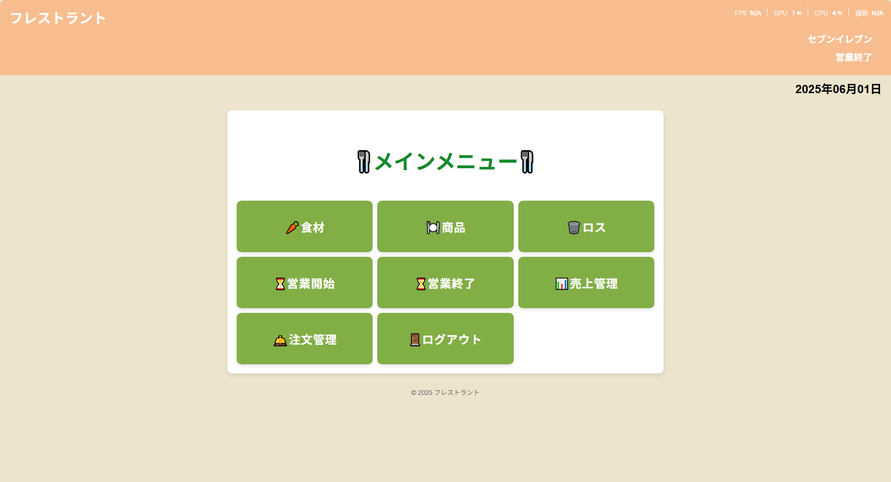
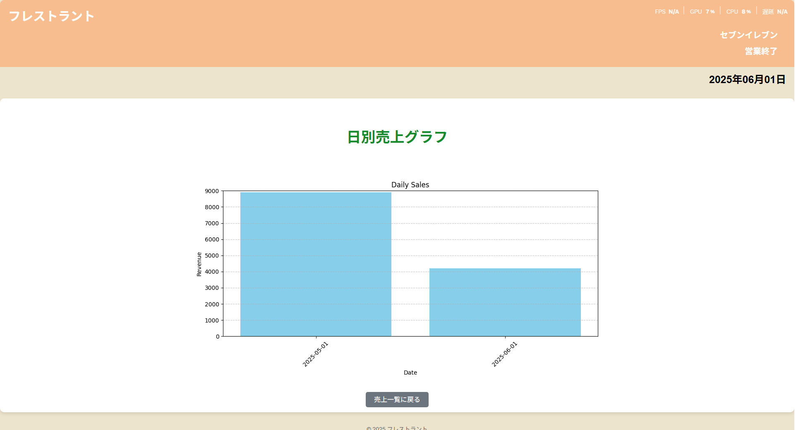

# Inventory Management System

## 概要
食品の在庫、商品、ロス、売上などを管理できるWebアプリです。飲食業や小売業向けに、業務効率化を目的としています。

## 主な機能
- ユーザー登録・ログイン

- メイン画面

- 食品・商品・ロスの詳細、登録、編集、検索


- 売り上げのグラフ表示

- 営業時間・売上・注文の管理


## 使用技術
- Python / Django（バックエンド）
- SQLite（データベース）
- HTML / CSS（フロントエンド）
- 
##苦労、工夫した点

- 変数名をしっかりと考え見やすいプログラムにしました
- データベース構造を把握するのが大変でした
- ユーザーにとって使いやすくて見やすいUI・機能になるよう工夫しました
- Djangoフレームワークの仕組みや流れを理解するのに苦労しましたが、簡単なアプリを作り徐々に理解を深めました
- 食材などの在庫数を正確に管理できるようにするのに苦労しました

## AI活用について  
開発にあたって、AI（ChatGPT）を活用して以下の支援を受けました。

- 機能設計やデータベース設計に関するアドバイス  
- フレームワークDjangoの扱い方
- エラーの原因特定と解決方法の提案  

## 起動方法（開発環境）
```bash
git clone https://github.com/daigo-jp/inventory-management-system.git
cd sotsu/pro_sotsu
python manage.py migrate
python manage.py runserver

